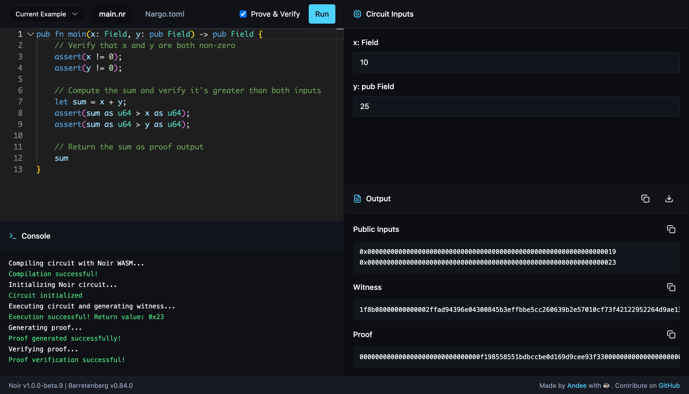

# 🔮 Noir Playground

A browser-based Noir zero-knowledge proof development environment with Monaco editor integration.

[](https://noir-lang.org/)
[](https://github.com/AztecProtocol/barretenberg)

🚀 **[Live Demo](https://noir-playground.app)** | 📚 **[Documentation](./docs/noirjs-barretenberg-integration.md)**



## Quick Start

```bash
# Clone and install
git clone https://github.com/0xandee/noir-playground.git
cd noir-playground
npm install

# Start development server
npm run dev
# → Open http://localhost:5173
```

## Features

-   **Monaco Editor** with Noir syntax highlighting
-   **Real-time compilation** simulation with 5-step workflow
-   **Dynamic input forms** generated from function signatures
-   **Multi-file support** (main.nr + Nargo.toml)
-   **Zero-knowledge proof** generation and verification
-   **Professional UI** with dark theme optimization

## Example

Write Noir circuits directly in the browser:

```noir
fn main(secret: Field, public_value: pub Field) -> Field {
    assert(secret > 0);
    assert(public_value > 0);
    secret + public_value
}
```

The playground automatically:

1. Generates input forms based on your function signature
2. Compiles and executes circuits
3. Generates zero-knowledge proofs
4. Provides detailed execution feedback

## Development

```bash
npm run dev      # Start development server
npm run build    # Build for production
npm run lint     # Run linter
npm run preview  # Preview production build
```

### Tech Stack

-   React 18.3+ + TypeScript 5.5+
-   Vite 5.4+ with WASM support
-   Monaco Editor 0.52+
-   ShadCN/UI + Tailwind CSS
-   **NoirJS Integration**: @noir-lang/noir_js ^1.0.0-beta.9
-   **Barretenberg Backend**: @aztec/bb.js ^0.84.0
-   **WASM Compilation**: @noir-lang/noir_wasm ^1.0.0-beta.9

> 📖 Learn more about the [NoirJS + Barretenberg integration](./docs/noirjs-barretenberg-integration.md) that powers this playground's zero-knowledge proof capabilities.

## Use Cases

-   **Learning Noir** - Interactive playground with instant feedback
-   **Prototyping ZK circuits** - Rapid iteration without local setup
-   **Teaching ZK concepts** - Visual workflow demonstration
-   **Experimenting** - Safe environment for testing ideas

## Roadmap

-   [ ] **Interactive DAG renders of ACIR bytecodes**: Visual representation of circuit compilation output
-   [ ] **Real-time circuit complexity metrics and heatmaps**: Performance analysis and optimization insights
-   [ ] **Runtime witness value probing**: Debug witness generation and constraint satisfaction
-   [ ] **Side-by-side inspector between code and constraints**: Compare Noir code with generated constraints
-   [ ] Ensure features compatibility with a future VS Code extension for core developer tools

## Backlog

-   [ ] **Circuit optimization** suggestions and analysis
-   [ ] **Preload Common Dependencies**: Bundle popular Noir libraries (std, aztec, crypto) locally to enable dependency usage without external fetching. Current issue: https://github.com/noir-lang/noir/issues/7823

## UI Inspiration

-   Inspired by the excellent [Cairo VM Playground](https://cairovm.codes/) and [Walnut](https://app.walnut.dev/).

## Contributing

We welcome contributions! See [CONTRIBUTING.md](./CONTRIBUTING.md) for guidelines.

## License

MIT © [Noir Playground Contributors](./LICENSE)
