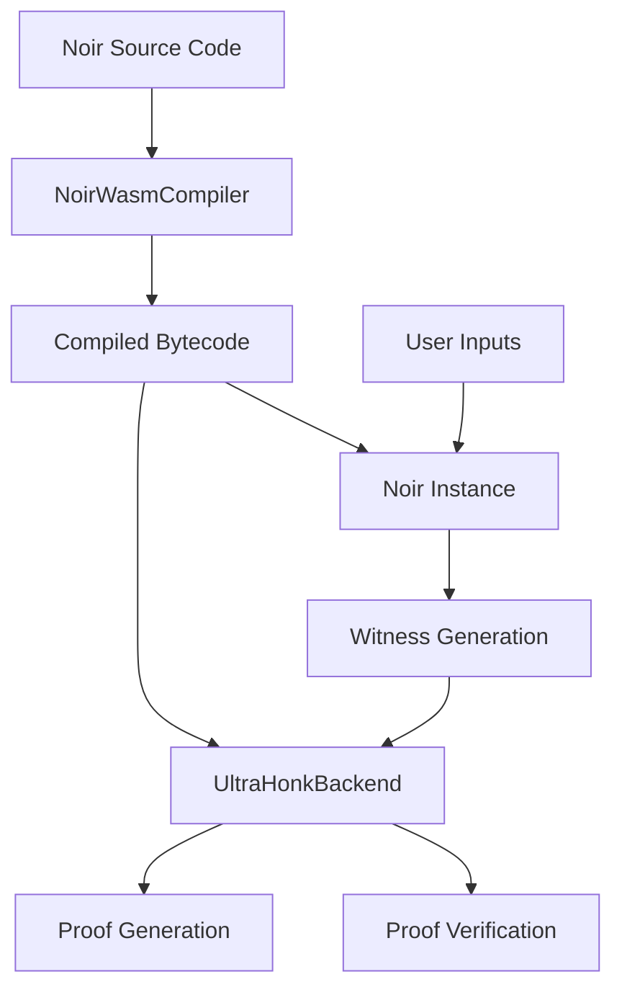

# NoirJS with Aztec's Barretenberg Backend Integration

This document provides a comprehensive guide to understanding how the Noir Playground integrates NoirJS with Aztec's Barretenberg backend to enable browser-based zero-knowledge proof generation, compilation, and verification.

## Table of Contents

1. [Overview](#overview)
2. [Architecture](#architecture)
3. [Core Dependencies](#core-dependencies)
4. [Implementation Details](#implementation-details)
5. [Workflow Breakdown](#workflow-breakdown)
6. [Browser Challenges & Solutions](#browser-challenges--solutions)
7. [Code Examples](#code-examples)
8. [Performance Considerations](#performance-considerations)

## Overview

### What is NoirJS?

NoirJS (`@noir-lang/noir_js`) is the JavaScript/TypeScript library that enables execution of Noir programs in JavaScript environments. It provides:

- Circuit execution with private/public inputs
- Witness generation from circuit execution
- Integration with various proving backends

### What is Barretenberg?

Barretenberg (`@aztec/bb.js`) is Aztec's high-performance proving backend that provides:

- **UltraHonk proving system**: Advanced proof generation algorithm
- **Circuit optimization**: Efficient constraint system handling
- **Verification**: Cryptographic proof verification

### Integration Benefits

This playground combines both technologies to achieve:

- **Client-side proving**: Generate proofs entirely in the browser
- **Real-time feedback**: Immediate compilation and execution results
- **Educational value**: Visual demonstration of the ZK proof workflow
- **No server dependencies**: Fully decentralized proof generation

## Architecture



### Key Components

1. **NoirWasmCompiler** (`src/services/NoirWasmCompiler.ts`)
   - Handles WASM-based compilation using `@noir-lang/noir_wasm`
   - Manages file system operations for Noir projects
   - Produces bytecode from Noir source

2. **NoirService** (`src/services/NoirService.ts`)
   - Orchestrates the entire ZK workflow
   - Manages Noir instance and Barretenberg backend
   - Provides step-by-step execution feedback

3. **NoirEditor** (`src/components/NoirEditor.tsx`)
   - Monaco Editor with Noir syntax highlighting
   - Real-time code editing experience

### Inspired By

This architecture draws inspiration from successful educational crypto tools like [evm.codes](https://github.com/duneanalytics/evm.codes) and builds upon patterns established in the [tiny-noirjs-app](https://github.com/noir-lang/tiny-noirjs-app), while incorporating lessons learned from other playground implementations in the ecosystem.

## Core Dependencies

### Essential Packages

```json
{
  "@noir-lang/noir_js": "^1.0.0-beta.9",
  "@aztec/bb.js": "^0.84.0",
  "@noir-lang/noir_wasm": "^1.0.0-beta.9"
}
```

### Vite Configuration Requirements

The integration requires specific Vite configuration for WASM support:

```typescript
// vite.config.ts key configurations
export default defineConfig({
  server: {
    headers: {
      "Cross-Origin-Embedder-Policy": "require-corp",
      "Cross-Origin-Opener-Policy": "same-origin",
    }
  },
  plugins: [
    wasm(),                 // Enable WASM loading
    topLevelAwait(),       // Support top-level await
  ],
  optimizeDeps: {
    include: ['@noir-lang/noir_js', '@aztec/bb.js'],
    exclude: ['@noir-lang/noir_wasm']  // Exclude from pre-bundling
  },
  define: {
    global: 'globalThis',   // Polyfill for global
  }
});
```

## Implementation Details

### 1. WASM Compilation Service

The `NoirWasmCompiler` class handles client-side compilation:

```typescript
export class NoirWasmCompiler {
  private fileManager: any;

  constructor() {
    this.fileManager = createFileManager('.');
  }

  async compileProgram(sourceCode: string, cargoToml?: string): Promise<WasmCompilationResult> {
    // Create virtual file system
    const sourceStream = new ReadableStream({
      start(controller) {
        controller.enqueue(new TextEncoder().encode(sourceCode));
        controller.close();
      }
    });

    // Write files to virtual FS
    await this.fileManager.writeFile(`noir_project/src/main.nr`, sourceStream);
    await this.fileManager.writeFile(`noir_project/Nargo.toml`, cargoStream);

    // Compile using noir_wasm
    const result = await compile_program(
      this.fileManager,
      '/noir_project',
      (message: string) => console.log('[Noir Compiler]', message)
    );

    return { success: true, program: result };
  }
}
```

### 2. Main Orchestration Service

The `NoirService` coordinates the entire workflow:

```typescript
export class NoirService {
  private noir?: Noir;
  private backend?: UltraHonkBackend;

  async executeCircuit(
    sourceCode: string, 
    inputs: Record<string, any>,
    onStep: (step: ExecutionStep) => void
  ): Promise<NoirExecutionResult> {
    
    // Step 1: Compile circuit
    const compilationResult = await noirWasmCompiler.compileProgram(sourceCode);
    
    // Step 2: Initialize Noir and Backend
    const program = (compilationResult.program as any).program;
    this.noir = new Noir(program);
    this.backend = new UltraHonkBackend(program.bytecode);
    
    // Step 3: Execute circuit (generate witness)
    const { witness, returnValue } = await this.noir.execute(inputs);
    
    // Step 4: Generate proof
    const proof = await this.backend.generateProof(witness);
    
    // Step 5: Verify proof
    const isValid = await this.backend.verifyProof(proof);
    
    return { proof: proof.proof, publicInputs: proof.publicInputs };
  }
}
```

## Workflow Breakdown

### 5-Step Execution Process

1. **WASM Compilation**
   - Convert Noir source code to bytecode
   - Use `@noir-lang/noir_wasm` with virtual file system
   - Handle Nargo.toml configuration

2. **Circuit Initialization**
   - Create Noir instance from compiled program
   - Initialize UltraHonkBackend with bytecode
   - Prepare for execution

3. **Witness Generation**
   - Execute circuit with user inputs
   - Generate cryptographic witness
   - Process input types (Field, arrays, etc.)

4. **Proof Generation**
   - Use UltraHonkBackend to create ZK proof
   - Handle witness data transformation
   - Generate proof artifacts

5. **Proof Verification**
   - Verify generated proof cryptographically
   - Confirm public input consistency
   - Return verification results

### Input Processing

```typescript
private processInputs(inputs: Record<string, any>): Record<string, any> {
  const processedInputs: Record<string, any> = {};
  
  for (const [key, value] of Object.entries(inputs)) {
    if (Array.isArray(value)) {
      processedInputs[key] = value;  // Preserve arrays
    } else {
      // Convert to numbers where possible
      processedInputs[key] = isNaN(Number(value)) ? value : Number(value);
    }
  }
  
  return processedInputs;
}
```

### Public Input Extraction

The service can extract public inputs without full proof generation:

```typescript
private extractPublicInputsFromCircuit(
  inputs: Record<string, any>, 
  sourceCode: string
): string[] {
  const publicInputs: string[] = [];
  
  // Parse main function signature
  const functionRegex = /fn\s+main\s*\([^)]*\)/;
  const match = sourceCode.match(functionRegex);
  
  if (match) {
    // Find parameters marked as 'pub'
    const pubParamRegex = /(\w+)\s*:\s*pub\s+(\w+)/g;
    let paramMatch: RegExpExecArray | null;
    
    while ((paramMatch = pubParamRegex.exec(match[0])) !== null) {
      const paramName = paramMatch[1];
      const paramValue = inputs[paramName];
      
      if (paramValue !== undefined) {
        // Format as hex string for consistency
        const hexValue = typeof paramValue === 'number' 
          ? paramValue.toString(16).padStart(64, '0')
          : paramValue.toString();
        publicInputs.push(hexValue);
      }
    }
  }
  
  return publicInputs;
}
```

## Browser Challenges & Solutions

### 1. WASM Loading Issues

**Challenge**: WASM modules require specific CORS headers and loading mechanisms.

**Solution**: Configure Vite with proper headers and WASM plugin:

```typescript
server: {
  headers: {
    "Cross-Origin-Embedder-Policy": "require-corp",
    "Cross-Origin-Opener-Policy": "same-origin",
  }
}
```

### 2. Memory Management

**Challenge**: Large circuits can consume significant browser memory.

**Solution**: 
- Reset services after each execution
- Use `optimizeDeps` to exclude heavy WASM modules from pre-bundling
- Implement proper cleanup in service classes

### 3. Async/Await Handling

**Challenge**: WASM modules often require top-level await.

**Solution**: Use `vite-plugin-top-level-await` and proper async initialization:

```typescript
private async initializeWasm(): Promise<void> {
  if (this.wasmInitialized) return;
  
  // Wait for WASM modules to be ready
  await new Promise(resolve => setTimeout(resolve, 100));
  this.wasmInitialized = true;
}
```

### 4. File System Simulation

**Challenge**: Noir compiler expects file system operations.

**Solution**: Use `createFileManager` with ReadableStreams:

```typescript
const sourceStream = new ReadableStream({
  start(controller) {
    controller.enqueue(new TextEncoder().encode(sourceCode));
    controller.close();
  }
});

await this.fileManager.writeFile(`noir_project/src/main.nr`, sourceStream);
```

## Code Examples

> 💡 **Note**: For additional examples and patterns, see the [official NoirJS tutorial](https://github.com/noir-lang/noir/blob/master/docs/docs/tutorials/noirjs_app.md) and the [tiny-noirjs-app](https://github.com/noir-lang/tiny-noirjs-app) repository.

### Basic Circuit Compilation and Execution

```typescript
import { noirService } from './services/NoirService';

// Define a simple circuit
const circuitCode = `
fn main(secret: Field, public_value: pub Field) -> Field {
    assert(secret > 0);
    assert(public_value > 0);
    secret + public_value
}
`;

// Define inputs
const inputs = {
  secret: 42,
  public_value: 100
};

// Execute with step-by-step feedback
const result = await noirService.executeCircuit(
  circuitCode,
  inputs,
  (step) => console.log(`${step.status}: ${step.message}`)
);

console.log('Proof generated:', !!result.proof);
console.log('Public inputs:', result.publicInputs);
console.log('Return value:', result.returnValue);
```

### Advanced Circuit with Arrays

```typescript
const arrayCircuit = `
fn main(values: [Field; 3], threshold: pub Field) -> pub Field {
    let sum = values[0] + values[1] + values[2];
    assert(sum > threshold);
    sum
}
`;

const arrayInputs = {
  values: [10, 20, 30],
  threshold: 50
};

const result = await noirService.executeCircuit(arrayCircuit, arrayInputs, console.log);
```

### Error Handling Pattern

```typescript
try {
  const result = await noirService.executeCircuit(sourceCode, inputs, onStep);
  
  if (result.error) {
    console.error('Execution failed:', result.error);
    return;
  }
  
  // Process successful result
  console.log('Proof verification:', result.steps.find(s => s.message.includes('verification')));
  
} catch (error) {
  console.error('Unexpected error:', error);
} finally {
  // Always reset for next execution
  noirService.reset();
}
```

## Performance Considerations

### Optimization Strategies

1. **Lazy Loading**: Initialize WASM modules only when needed
2. **Memory Management**: Reset services after each execution
3. **Chunk Splitting**: Separate Noir libraries in build chunks
4. **Caching**: Cache compiled circuits when possible

### Build Configuration

```typescript
build: {
  rollupOptions: {
    output: {
      manualChunks: {
        vendor: ['react', 'react-dom'],
        noir: ['@noir-lang/noir_js', '@aztec/bb.js'],  // Separate chunk
        ui: ['@radix-ui/react-dialog', '@radix-ui/react-select']
      }
    }
  }
}
```

### Memory Usage Tips

- Use `proveAndVerify: false` for testing execution without proof generation
- Implement circuit size limits for browser constraints
- Monitor memory usage during long compilation sessions

## Related Projects

This playground draws inspiration from and complements other educational cryptographic tools:

### Noir Ecosystem
- **[signorecello/noir-playground](https://github.com/signorecello/noir-playground)** - Alternative Noir playground implementation with different UI/UX approaches
- **[noir-lang/tiny-noirjs-app](https://github.com/noir-lang/tiny-noirjs-app)** - Minimal NoirJS example demonstrating core integration patterns

### Educational Crypto Playgrounds
- **[walnuthq/cairovm.codes](https://github.com/walnuthq/cairovm.codes)** - Cairo VM playground for StarkNet development, similar educational approach
- **[duneanalytics/evm.codes](https://github.com/duneanalytics/evm.codes)** - EVM opcodes reference and playground, inspiration for interactive crypto education

These projects demonstrate the growing ecosystem of browser-based cryptographic development tools, each contributing to making complex technologies more accessible through interactive education.

## References

### Official Documentation
- **[NoirJS Tutorial](https://github.com/noir-lang/noir/blob/master/docs/docs/tutorials/noirjs_app.md)** - Official NoirJS integration tutorial
- **[Aztec Barretenberg Documentation](https://docs.aztec.network/developers/proving-backends/barretenberg)** - Barretenberg proving backend documentation
- **[Noir Language Documentation](https://noir-lang.org/)** - Complete Noir language reference

### Implementation Resources
- **[tiny-noirjs-app](https://github.com/noir-lang/tiny-noirjs-app)** - Minimal working example for NoirJS integration patterns
- **[WASM Integration Guide](https://vitejs.dev/guide/features.html#webassembly)** - Vite WASM configuration and best practices

## Troubleshooting

### Common Issues

1. **CORS Errors**: Ensure proper server headers in Vite config
2. **WASM Loading Failures**: Check that WASM files are accessible in public directory
3. **Memory Errors**: Implement proper cleanup and reset procedures
4. **Compilation Timeouts**: Increase timeout limits for large circuits

This integration showcases the power of client-side zero-knowledge proof generation, making ZK technology more accessible for education and rapid prototyping.